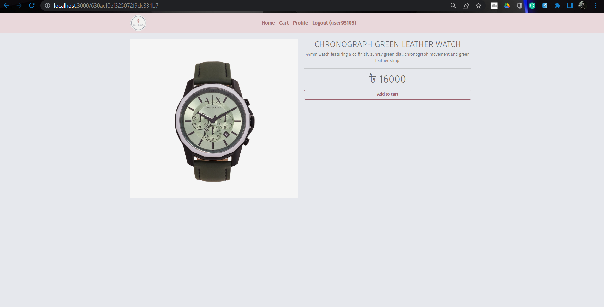

<h1 align="center">
🌐 MERN Stack
</h1>
<p align="center">
MongoDB, Expressjs, React/Redux, Nodejs
</p>

<p align="center">
   <a href="https://travis-ci.com/amazingandyyy/mern">
      
   </a>
</p>


# Tech-Stack
```terminal
Frontend: React, HTML, CSS (Bootstrap, Material UI), Javascript
Bankend: Node.js, Express.js
Backend Testing Tool: Postman
Database: MongoDB
```

# Features

Three types of users: customers, seller and admin

### User Functionalities:
- Signup
- Login
- Set Up Bank Account
- Visit Product Page
- See Product Details
- Add Products to Cart
- Purchase Orders
- See and Update his info. (See Bank Balance)
- See recent ordered product history

### Seller Functionalities:
- Signup as a seller
- Login as a seller
- Set Up Bank Account
- See his/her statistics (Including Bank Balance)
- Add Products
- See Profile
- See Current Orders of his products

### Admin Functionalities:
- Observe basic ecommerce statistics (Inclusing Ecommerce Account Balance)
- See Product List
- See Order History
- See User List
- See Supplier List

### Bank API Functionalities:
- Create bank account
- Check balance
- Verify transaction: check valid card number, secret number, and sufficient balance. 
- adjust the balance of users, sellers and ecommerce admin


# Run This Mern Repository To Your Local Device

> MERN is a fullstack implementation in MongoDB, Expressjs, React/Redux, Nodejs.

MERN stack is the idea of using Javascript/Node for fullstack web development.

## clone or download
```terminal
$ git clone https://github.com/baizidjilani/La-Tienda.git
$ npm i
```

## project structure
```terminal
LICENSE
package.json
frontend/
   package.json
   .env 
ecommerce-api/
   package.json
   
bank-api/
   package.json
   
supplier-api/
   package.json
...
```

# Usage (run fullstack app on your machine)

## Prerequisites
- [MongoDB](https://www.mongodb.com/try/download/community)
- [Node](https://nodejs.org/en/download/)
- [npm](https://nodejs.org/en/download/package-manager/)

Here, we need to run frontend, bank-api, ecommerce-api and supllier api concurrently in different terminal session to make them interchange information to each other

## Frontend (Client Side) (PORT: 3000)
```terminal
$ cd frontend   // go to frontend folder
$ npm i       // npm install packages
$ npm start // run the frontend side
```


### Start Bank API (Server Side) (PORT: 7000)

```terminal
$ cd bank-api   // go to bank-api folder
$ npm i       // npm install packages
$ node index.js // run it and connect to server and database
```

### Start Ecommerce API (Server Side) (PORT: 5000)

```terminal
$ cd ecommerce-api   // go to ecommerce-api folder
$ npm i       // npm install packages
$ node index.js // run it and connect to server and database
```

### Start Supplier API (Server Side) (PORT: 4000)

```terminal
$ cd supplier-api   // go to server folder
$ npm i       // npm install packages
$ node index.js // run it and connect to server and database
```

# Some Given Credentials

## User Credentials
```terminal
User Name: user95105
Password: 95105
Bank Card Number: 95105
Bank Secret Number: 95105
```

## Supplier Credentials
```terminal
User Name: seller3
Password: user123
Bank Card Number: 1234567890 
Bank Secret Number: 1234
```

## Admin Credentials
```terminal
User Name: user8888
Password: 8888
Bank Card Number: 8888 
Bank Secret Number: 8888 
```


# Dependencies(tech-stacks)
Frontend | Bank API | Supllier API| Ecommerce API
--- | ---| ---| ---
bootstrap: "^5.2.0"| cors: "^2.8.5"| cors: "^2.8.5"| cors: "^2.8.5"
material-react-table: "^0.40.2"| crypto-js: "^4.1.1"| crypto-js: "^4.1.1"| crypto-js: "^4.1.1"
react: "^18.2.0" | cors: ^2.8.1| cors: ^2.8.1| cors: ^2.8.1
react-bootstrap: "^2.5.0"| dotenv: "^16.0.1"| dotenv: "^16.0.1"| dotenv: "^16.0.1"
react-dom: "^18.2.0" | express: "^4.18.1"| express: "^4.18.1"| express: "^4.18.1"
react-router-dom: "^6.3.0"| mongoose: "^6.5.2"| mongoose: "^6.5.2"| mongoose: "^6.5.2"
react-scripts: "5.0.1"| multer: "^1.4.5-lts.1"| multer: "^1.4.5-lts.1"| multer: "^1.4.5-lts.1"
react-use-cart: "^1.13.0"| nodemon: "^2.0.19"| nodemon: "^2.0.19"| nodemon: "^2.0.19"
web-vitals: "^2.1.4"|||


## Screenshots

<p float="left">
  
  
  
</p>
<p float="left">
  
  
  
</p>
<p float="left">
  
  
  
</p>
<p float="left">
 
  
  
  
</p>
<p float="left">
  
  
  
</p>
<p float="left">
  
  
  
</p>
<p float="left">
  
  
  
</p>


# Authors
- [Sourav Saha](https://github.com/bracealround) (2017331095)
- [Golam Jilani](https://github.com/baizidjilani) (2017331105)
